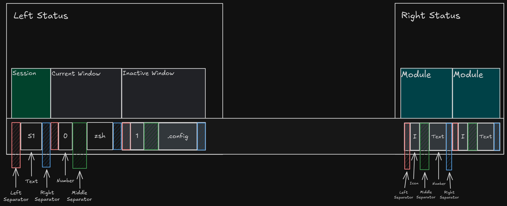

# Mountain Theme for Tmux

A highly customizable and visually appealing Tmux theme plugin that
integrates dynamic options, vibrant colors, and transparent backgrounds.
This plugin provides flexibility and style, adapting to user
preferences for session management, window status, and status bar customization.

---

## **Features**

- **Dynamic Themes**: Select from pre-configured palettes (e.g., `fuji`)
  or create your own.
- **Transparent Backgrounds**: Optional transparency for seamless terminal blending.
- **Customizable Icons and Titles**:
  - Session icon.
  - Active and inactive window icons.
  - Zoomed and synchronized pane icons.
- **Status Bar Modules**: Add modules like datetime,
  application info, user information, and more.
- **Enhanced Styling**: Configurable pane borders, separators, and colors.

---

## **Installation**

### **Prerequisites**

- Tmux (version 2.1 or higher).
- Shell utilities (e.g., `bash`, `awk`).
- A font that supports the icons (e.g., Nerd Fonts).

### **Using TPM (Tmux Plugin Manager)**

1. Add the plugin to your Tmux configuration:

   ```bash
   set -g @plugin 'Tecu23/tmux-mountain-theme'
   ```

2. Press `prefix + I` inside Tmux to install the plugin.
3. Restart Tmux or reload the configuration:

   ```bash
   tmux source-file ~/.tmux.conf
   ```

---

## **Configuration**



The plugin is highly configurable using Tmux options. Add the following options
to your `~/.tmux.conf` or `~/.tmux.conf.local` to customize the theme:

### **General Settings**

- **Theme Variation**:

  ```bash
  set -g @mountain_theme_variation 'fuji'
  ```

- **Transparent Background**:

  ```bash
  set -g @mountain_theme_transparent_bg 'true'
  ```

---

### **Session Options**

- **Session Icon**:

  ```bash
  set -g @mountain_theme_session_icon ''
  ```

---

### **Window Options**

- **Active Window**:

  - Icon:

  ```bash
    set -g @mountain_theme_plugin_active_window_icon ''
  ```

  - Title:

    ```bash
    set -g @mountain_theme_active_window_title '#W'
    ```

- **Inactive Window**:

  - Icon:

    ```bash
    set -g @mountain_theme_plugin_inactive_window_icon ''
    ```

  - Title:

    ```bash
    set -g @mountain_theme_inactive_window_title '#W'
    ```

- **Zoomed Window Icon**:

  ```bash
  set -g @mountain_theme_plugin_zoomed_window_icon ''
  ```

- **Synchronized Pane Icon**:

  ```bash
  set -g @mountain_theme_plugin_pane_synchronized_icon '✵'
  ```

---

### **Separators**

- **Left Separator**:

  ```bash
  set -g @mountain_theme_left_separator ' '
  ```

- **Middle Separator**:

  ```bash
  set -g @mountain_theme_middle_separator '█'
  ```

- **Right Separator**:

  ```bash
  set -g @mountain_theme_right_separator ''
  ```

---

### **Status Options**

- **Status Modules**: Add status modules to the right side of the status bar:

  ```bash
  set -g @mountain_theme_status_options 'datetime,application,user'
  ```

- **Custom Icons and Colors for Modules**: Example: Customize the `user` module:
  ```bash
  set -g @mountain_theme_status_user_icon ''
  set -g @mountain_theme_status_user_accent_color 'normal_blue'
  set -g @mountain_theme_status_user_icon_color 'bright_blue'
  set -g @mountain_theme_status_user_text ' #(whoami)'
  ```

---

## **Development**

### **TODO**

- Implement improved transparent background settings.
- Add support for user-defined custom status modules.

### **Testing**

To test changes, reload the Tmux configuration:

```bash
tmux source-file ~/.tmux.conf
```

---

## **Troubleshooting**

- **Icons Not Displaying Properly**: Ensure your terminal uses a font
  that supports icons, such as [Nerd Fonts](https://www.nerdfonts.com/).
- **Colors Not Applying**: Verify your terminal supports true colors
  (`tmux -2` for 256 colors).
- **Transparent Background Not Working**: Check your terminal's transparency
  settings (e.g., `background_opacity` in Alacritty or Kitty).

---

## **Contributing**

Pull requests and issues are welcome! Please follow these steps to contribute:

1. Fork the repository.
2. Create a new branch for your feature or bug fix.
3. Submit a pull request with a clear description of your changes.

---

## **License**

This plugin is licensed under the MIT License.
